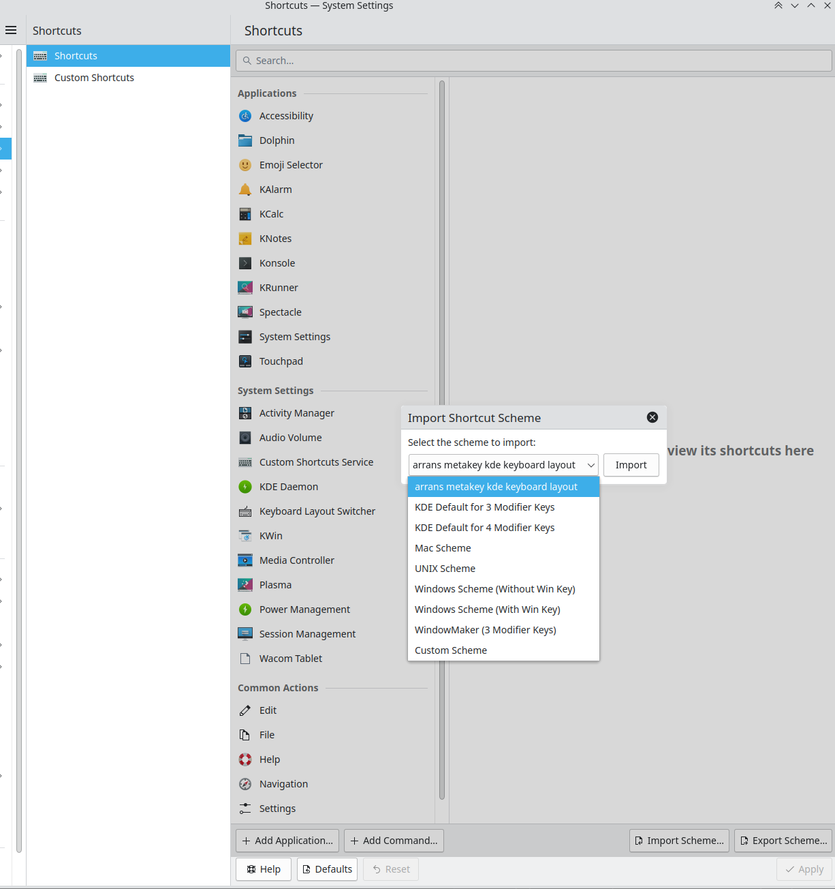

# arrans-kde-keyboard-shortcuts-with-meta

A repo for my KDE keyboard shortcuts (not that interesting) that uses a github workflow to create a deb file in the 
releases section for easy install. 

# Intention

Adds it here:

